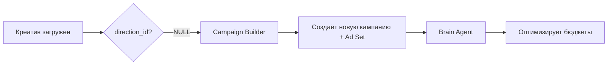
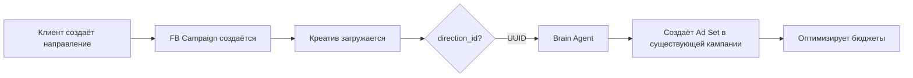

# Campaign Builder vs Brain Agent: Когда использовать что?

## 🎯 TL;DR

- **Campaign Builder** → Только для LEGACY (креативы БЕЗ `direction_id`)
- **Brain Agent** → Основной агент, управляет Ad Sets в существующих кампаниях направлений

---

## 📊 Campaign Builder (Автозапуск новых креативов)

### Назначение
Автоматический запуск новых креативов в рекламу — создаёт НОВЫЕ кампании с Ad Sets.

### Когда используется?
- ✅ **ТОЛЬКО для креативов БЕЗ `direction_id`** (legacy режим)
- ✅ Когда у клиента НЕТ настроенных направлений
- ✅ Автоматический запуск новых креативов по расписанию

### Что делает?
1. Берёт готовые креативы (`is_active=true`, `status=ready`, `direction_id IS NULL`)
2. Анализирует их с помощью LLM
3. Выбирает лучшие креативы для запуска
4. **СОЗДАЁТ НОВЫЕ Facebook Campaigns** с Ad Sets для выбранных креативов

### Входные данные
```javascript
{
  directionId: null, // Только для legacy креативов!
  user_account_id: "...",
  // ...
}
```

### API Endpoint
```
POST /api/campaign-builder/run
```

### Код
`services/agent-service/src/lib/campaignBuilder.ts`

---

## 🧠 Brain Agent (Главный агент управления рекламой)

### Назначение
Основной агент, который управляет всей рекламой — анализирует результаты, корректирует бюджеты, создаёт/паузит Ad Sets.

### Когда используется?
- ✅ **Для ВСЕХ кампаний** (с направлениями и без)
- ✅ **Для креативов С `direction_id`** (новый режим)
- ✅ Ежедневный анализ и оптимизация
- ✅ Создание новых Ad Sets **ВНУТРИ существующих кампаний направлений**

### Что делает?
1. Получает все активные кампании, Ad Sets, направления
2. Анализирует метрики (CPL, QCPL, HS)
3. Принимает решения:
   - Изменение бюджетов Ad Sets
   - Пауза плохих Ad Sets/Ads
   - **Создание новых Ad Sets в существующих кампаниях направлений**
4. Формирует отчёт и отправляет в Telegram

### Входные данные (llmInput)
```javascript
{
  userAccountId: "...",
  directions: [ // ← Новое!
    {
      id: "uuid",
      name: "Имплантация",
      objective: "whatsapp",
      fb_campaign_id: "123456", // ← СУЩЕСТВУЮЩАЯ кампания
      daily_budget_cents: 5000,
      target_cpl_cents: 200,
    }
  ],
  analysis: {
    campaigns: [
      {
        campaign_id: "123456",
        direction_id: "uuid", // ← Привязка к направлению
        direction_name: "Имплантация",
        direction_daily_budget_cents: 5000,
        direction_target_cpl_cents: 200,
        // ...
      }
    ],
    adsets: [ /* ... */ ],
  },
  scoring: { /* ... */ }
}
```

### API Endpoint
```
POST /api/brain/run
```

### Код
- `services/agent-brain/src/server.js` (основной)
- `services/agent-brain/src/scoring.js` (скоринг креативов)

---

## 🆚 Сравнительная таблица

| Характеристика | Campaign Builder | Brain Agent |
|----------------|------------------|-------------|
| **Креативы** | БЕЗ `direction_id` | С `direction_id` + legacy |
| **Кампании** | СОЗДАЁТ новые | Работает с существующими |
| **Ad Sets** | Создаёт в новых кампаниях | Создаёт в существующих кампаниях направлений |
| **Направления** | Не поддерживает | Полная поддержка |
| **Частота** | По требованию / расписание | Ежедневно (08:00) |
| **Бюджеты** | Глобальные `targets.*` | По направлениям `direction_daily_budget_cents` |
| **CPL** | Глобальный `targets.cpl_cents` | По направлениям `direction_target_cpl_cents` |
| **Scoring** | Упрощённый | Полный (Scoring Agent) |
| **Отчёт** | Минимальный | Детальный с группировкой по направлениям |

---

## 🔄 Workflow: Как это работает вместе?

### Сценарий 1: Клиент БЕЗ направлений (Legacy)



1. Клиент загружает креатив → `direction_id = NULL`
2. **Campaign Builder** создаёт новую кампанию с Ad Set
3. **Brain Agent** ежедневно оптимизирует все кампании

### Сценарий 2: Клиент С направлениями (New)



1. Клиент создаёт направление → API создаёт **пустую FB Campaign** сразу
2. Клиент загружает креатив → помечает `direction_id`
3. **Brain Agent** анализирует креативы (через Scoring Agent)
4. **Brain Agent** создаёт новые Ad Sets **ВНУТРИ существующей кампании направления**
5. **Brain Agent** ежедневно оптимизирует все Ad Sets в контексте их направлений

---

## 🎯 Правила принятия решения

### Когда НЕ использовать Campaign Builder?

❌ Если у клиента есть хотя бы 1 активное направление
❌ Если креатив имеет `direction_id` (не NULL)
❌ Если нужно создать Ad Set в существующей кампании

### Когда использовать только Brain Agent?

✅ Если у клиента настроены направления
✅ Для оптимизации существующих кампаний
✅ Для запуска новых креативов **с `direction_id`**

---

## 💡 Примеры

### Пример 1: Legacy пользователь

**user_accounts:**
- `id`: abc-123
- НЕТ записей в `account_directions`

**user_creatives:**
```json
{
  "id": "creative-1",
  "direction_id": null, // ← Legacy!
  "is_active": true,
  "status": "ready"
}
```

**Что происходит?**
- **Campaign Builder** → Создаёт новую кампанию
- **Brain Agent** → Оптимизирует все кампании (используя глобальные targets)

---

### Пример 2: Пользователь с направлениями

**account_directions:**
```json
{
  "id": "dir-1",
  "name": "Имплантация",
  "objective": "whatsapp",
  "fb_campaign_id": "camp-123", // ← Уже существует!
  "daily_budget_cents": 5000,
  "target_cpl_cents": 200,
  "is_active": true
}
```

**user_creatives:**
```json
{
  "id": "creative-2",
  "direction_id": "dir-1", // ← Привязан к направлению!
  "is_active": true,
  "status": "ready"
}
```

**Что происходит?**
- **Campaign Builder** → НЕ ИСПОЛЬЗУЕТСЯ
- **Brain Agent** → Анализирует креативы через Scoring Agent
- **Brain Agent** → Создаёт Ad Set **внутри camp-123** (existing campaign)
- **Brain Agent** → Следит чтобы сумма бюджетов Ad Sets ≤ 5000 центов (бюджет направления)

---

## 🚀 Развитие системы

### Текущее состояние
- ✅ Campaign Builder работает только с legacy креативами
- ✅ Brain Agent полностью поддерживает направления
- ✅ Scoring Agent фильтрует креативы по активным направлениям

### Будущее (если потребуется)
- 🔮 Возможно полный отказ от Campaign Builder в пользу Brain Agent
- 🔮 Миграция всех legacy кампаний в направления
- 🔮 Автоматическое предложение направлений на основе креативов

---

## 📞 Контакты

Если есть вопросы по архитектуре или нужно добавить новую функциональность:
1. Прочитай этот документ
2. Изучи SYSTEM_PROMPT в Brain Agent (`services/agent-brain/src/server.js`, строка 814)
3. Проверь Campaign Builder SYSTEM_PROMPT (`services/agent-service/src/lib/campaignBuilder.ts`)

**Основное правило:** 1 направление = 1 Facebook Campaign (создаётся при создании направления), внутри могут быть множество Ad Sets, которыми управляет Brain Agent.

