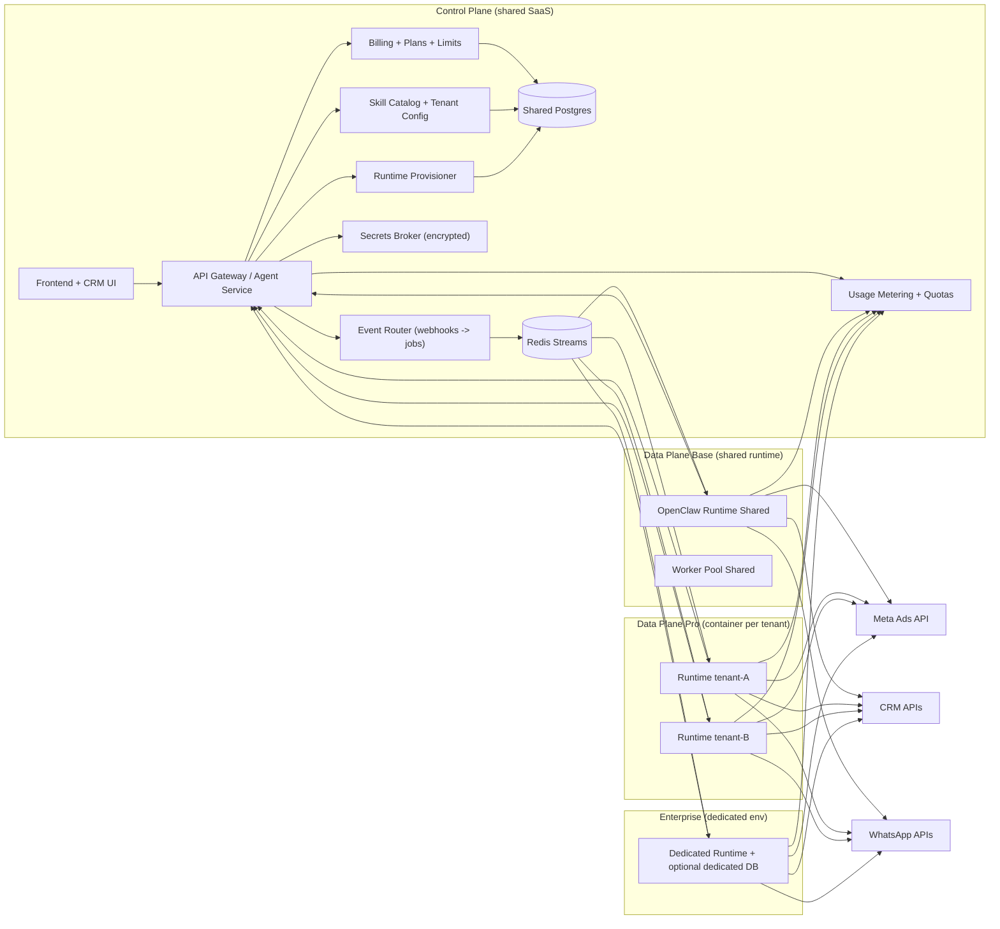

# OpenClaw Runtime в Multi-Tenant SaaS: Control Plane + Data Plane

## 1) Что есть сейчас (факты из репозитория)

- Инфраструктура сейчас на `docker-compose` (единый stack), без Kubernetes/Helm/Terraform манифестов в репо.
- Основные сервисы: `agent-service`, `agent-brain`, `chatbot-service`, `crm-backend`, `telegram-claude-bot`, Redis/Loki/Grafana, Evolution API.
- База данных общая (Supabase/Postgres), модель мультиарендности сегодня через `user_account_id` + `account_id` (ad account UUID), а не через единый `tenant_id`.
- OpenClaw уже используется отдельно как runtime/admin-агент (вне compose), с собственным gateway и skill workflow (пример: call-analysis cron).
- Секреты интеграций сейчас в основном хранятся в `user_accounts`/`ad_accounts`/`whatsapp_phone_numbers` (OAuth токены, API keys).
- В backend-сервисах используется Supabase `service_role`, то есть RLS на уровне DB не является единственной защитой (контроль tenancy в коде обязателен).

Ключевые файлы:
- `docker-compose.yml`
- `OPENCLAW.md`
- `migrations/057_create_ad_accounts_table.sql`
- `migrations/067_add_account_id_to_remaining_tables.sql`
- `migrations/190_subscription_billing_crm.sql`
- `migrations/223_create_openclaw_reader.sql`
- `services/agent-service/src/lib/adAccountHelper.ts`
- `services/agent-service/src/lib/amocrmTokens.ts`
- `services/chatbot-service/src/workers/campaignWorker.ts`

## 2) Целевая модель (без клонирования всего SaaS)

Принцип:
- **Control Plane** остается единым (ваш текущий SaaS).
- **Data Plane** масштабируется по тарифу (shared runtime / per-tenant runtime / dedicated environment).

### 2.1 Архитектура (диаграмма)

### 2.2 Разделение ответственности

**В Control Plane (общий для всех):**
- Auth/users/roles/UI.
- Billing, подписки, ограничения, usage-учет.
- Каталог скиллов и policy (что можно в Base/Pro/Enterprise).
- Provisioning lifecycle runtime.
- Secrets broker (выдача секретов runtime по короткоживущему токену).
- Webhook intake (Meta/CRM/WhatsApp) + маршрутизация jobs.

**В Data Plane (runtime исполнения):**
- OpenClaw orchestrator, execution engine и workers.
- Выполнение skill/workflow шагов.
- Retry/idempotency execution, статус ранов, heartbeat.
- Runtime-level throttling и isolation.

## 3) Где размещать orchestrator и skills

### 3.1 Orchestrator

Рекомендуемая модель:
- Вынести OpenClaw runtime в отдельный контейнерный сервис (образ), не смешивать с `agent-service`/`agent-brain`.
- Control Plane управляет runtime через `runtime_instances` + Provisioner API.
- Runtime исполняет jobs из очередей, а бизнес-операции вызывает через существующие API SaaS или прямые интеграции.

### 3.2 Skills

Разделить на 2 слоя:
- **Skill Catalog (global):** версии и пакеты skills, доступные платформенно.
- **Skill Instances (tenant-scoped):** включение skill для конкретного tenant + его config/policy.

Где хранить:
- Код skill пакетов: git/registry artifact (immutable versioned bundle).
- Конфиг per tenant: таблицы `skill_instances`, `workflows`.

## 4) Модель развёртывания по тарифам

## 4.1 Base (shared runtime)

Модель:
- Один shared runtime pool на всех Base tenants.
- Изоляция логическая: `tenant_id` на jobs/runs/messages/secrets + строгий quota/rate limit.
- Разрешены только platform-approved skills.

Гарантии:
- Логическая изоляция данных и секретов.
- Fair-share scheduler + per-tenant limits.
- Нет process-level isolation.

## 4.2 Pro (container per tenant)

Модель:
- На оплате Pro автоматически поднимается отдельный runtime-контейнер tenant-а.
- SaaS и БД остаются shared.
- У tenant-а выделенный runtime, отдельная job-очередь/consumer group, отдельный secret scope, resource limits.

Как именно (под текущий стек):
- Краткосрок: `docker-compose` project-per-tenant (`openclaw-runtime` сервис) на текущей инфраструктуре.
- Среднесрок: переход на Kubernetes namespace-per-tenant, когда Pro tenants станет много.

Минимальные настройки контейнера Pro:
- CPU/memory limits (`--cpus`, memory limit).
- Read-only root fs, non-root user.
- Per-tenant runtime token.
- Queue prefix `oc:jobs:tenant:<tenant_id>`.
- Логи с label `tenant_id`, `runtime_id`.

## 4.3 Enterprise (dedicated)

Модель:
- Выделенный хост/кластер и отдельный runtime environment.
- Опционально DB-per-tenant (или schema-per-tenant) по требованиям compliance/SLA.

Когда включать Enterprise:
- Требование data residency/compliance.
- Повышенный SLA (например 99.9%+ с выделенным контуром).
- Высокие нагрузки/кастомные интеграции.
- Жесткая регуляторика по секретам/логам.

## 5) Multi-tenant isolation: что изолируем, что оставляем shared

Изолировать per tenant:
- Secrets и доступ к ним.
- Job queues/consumer group.
- Runtime worker concurrency и CPU/memory budget.
- Usage quotas/rate limits.
- Логи/трейсы/метрики (как минимум логическая сегрегация по tenant_id).

Оставить общим:
- Основной SaaS Control Plane.
- Shared DB (на старте) с `tenant_id` + `account_id`.
- Общий биллинг/auth/UI.

Матрица гарантий:

| Модель | Изоляция compute | Изоляция данных | Изоляция секретов | Blast radius |
|---|---|---|---|---|
| Base | Логическая | Логическая (`tenant_id`) | Строгая per-tenant | Средний |
| Pro | Контейнерная | Логическая (`tenant_id`) | Строгая + runtime scope | Низкий |
| Enterprise | Выделенная среда | Опц. отдельная DB/schema | Максимальная | Минимальный |

## 6) База данных: практичная стратегия

Рекомендуется:
- Оставить **единую shared DB**.
- Ввести канонический `tenant_id` в новые runtime-таблицы.
- Существующую модель `user_account_id`/`account_id` сохранить и связать через mapping.

Практичная совместимость:
- На первом этапе `tenant_id = user_accounts.id`.
- `account_id` (ad account UUID) остается подуровнем tenant-а.

Когда нужен schema/DB-per-tenant:
- Enterprise, compliance, отдельные backup/SLA требования.
- Нельзя обеспечить юридически достаточную изоляцию в shared DB.

## 7) Спецификация сущностей данных

Ниже минимальный набор таблиц для OpenClaw runtime слоя.

### 7.1 Core tenancy

- `tenants`
  - `id uuid pk`
  - `owner_user_account_id uuid`
  - `plan_code text` (`base|pro|enterprise`)
  - `runtime_mode text` (`shared|container|dedicated`)
  - `status text` (`active|suspended|offboarded`)
  - `current_runtime_id uuid null`
  - `custom_fields jsonb default '{}'`
  - `created_at`, `updated_at`
  - Indexes: `(plan_code, status)`, `(owner_user_account_id)`

- `runtime_instances`
  - `id uuid pk`
  - `tenant_id uuid null` (null для shared runtime)
  - `mode text`
  - `provider text` (`docker|k8s`)
  - `host text`, `container_name text`, `image_tag text`
  - `status text` (`provisioning|healthy|degraded|stopped`)
  - `queue_namespace text`
  - `last_heartbeat_at timestamptz`
  - `metadata jsonb`
  - Indexes: `(tenant_id, status)`, `(status, last_heartbeat_at)`

### 7.2 Integrations/secrets

- `integrations`
  - `id uuid pk`
  - `tenant_id uuid not null`
  - `account_id uuid null` (если нужно разделение по ad account)
  - `type text` (`meta_ads|amocrm|bitrix24|whatsapp|custom`)
  - `status text`
  - `config jsonb default '{}'`
  - `last_sync_at`
  - Unique: `(tenant_id, account_id, type)`

- `integration_secrets`
  - `id uuid pk`
  - `tenant_id uuid not null`
  - `integration_id uuid not null`
  - `secret_name text`
  - `ciphertext bytea/text`
  - `key_version text`
  - `created_at`, `rotated_at`
  - `deleted_at`
  - Indexes: `(tenant_id, integration_id)`, partial on `deleted_at is null`

### 7.3 Skills/workflows/execution

- `skills`
  - `id uuid pk`
  - `skill_key text`
  - `version text`
  - `package_ref text` (artifact/git ref)
  - `checksum text`
  - `tier_min text` (`base|pro|enterprise`)
  - `is_active bool`
  - Unique: `(skill_key, version)`

- `skill_instances`
  - `id uuid pk`
  - `tenant_id uuid not null`
  - `skill_id uuid not null`
  - `enabled bool`
  - `config jsonb default '{}'`
  - `execution_policy jsonb default '{}'`
  - Unique: `(tenant_id, skill_id)`

- `workflows`
  - `id uuid pk`
  - `tenant_id uuid not null`
  - `name text`
  - `trigger_type text` (`webhook|cron|manual|event`)
  - `definition jsonb`
  - `status text`
  - Indexes: `(tenant_id, status)`, `(tenant_id, trigger_type)`

- `runs`
  - `id uuid pk`
  - `tenant_id uuid not null`
  - `runtime_id uuid not null`
  - `workflow_id uuid null`
  - `skill_instance_id uuid null`
  - `status text` (`queued|running|succeeded|failed|timeout`)
  - `priority smallint`
  - `queued_at`, `started_at`, `finished_at`
  - `error_code text`, `error_message text`
  - `input jsonb`, `output jsonb`
  - `usage_tokens_in bigint`, `usage_tokens_out bigint`, `usage_cost_usd numeric`
  - Indexes: `(tenant_id, queued_at desc)`, `(tenant_id, status, started_at desc)`

- `messages`
  - `id uuid pk`
  - `tenant_id uuid not null`
  - `run_id uuid`
  - `channel text`
  - `direction text` (`inbound|outbound|internal`)
  - `payload jsonb`
  - `external_message_id text`
  - `created_at`
  - Indexes: `(tenant_id, created_at desc)`, `(tenant_id, channel, created_at desc)`

### 7.4 Limits/usage/audit

- `usage_limits`
  - `tenant_id uuid pk`
  - `tasks_per_min int`
  - `tasks_per_month bigint`
  - `messages_per_month bigint`
  - `dialogs_per_month bigint`
  - `llm_tokens_per_month bigint`
  - `concurrency_limit int`
  - `max_whatsapp_numbers int`
  - `max_crm_connectors int`
  - `max_workflows int`
  - `max_users int`

- `usage_events`
  - `id uuid pk`
  - `tenant_id uuid not null`
  - `run_id uuid null`
  - `event_type text`
  - `quantity numeric`
  - `unit text`
  - `cost_usd numeric null`
  - `metadata jsonb`
  - `created_at`
  - Indexes: `(tenant_id, created_at desc)`, `(tenant_id, event_type, created_at desc)`

- `audit_logs`
  - `id uuid pk`
  - `tenant_id uuid`
  - `actor_type text` (`user|system|runtime`)
  - `actor_id text`
  - `action text`
  - `resource_type text`
  - `resource_id text`
  - `payload jsonb`
  - `created_at`
  - Indexes: `(tenant_id, created_at desc)`, `(action, created_at desc)`

### 7.5 JSONB custom_fields и индексация

Подход:
- Использовать `custom_fields jsonb` для редких/изменяемых полей.
- Для частых фильтров не полагаться только на GIN: вынести в явные колонки или expression index.

Рекомендации:
- Общий GIN индекс: `USING gin(custom_fields jsonb_path_ops)` только на read-heavy таблицах.
- Частые ключи:
  - expression index: `((custom_fields->>'region'))`
  - numeric cast index: `(((custom_fields->>'priority')::int))`
- Для больших таблиц `runs/messages/usage_events` сразу закладывать partitioning по месяцу.

## 8) Provisioning lifecycle (MVP и дальше)

### 8.1 Что происходит при оплате Pro

1. Billing webhook обновляет план tenant-а (`plan_code=pro`).
2. Control Plane создает `runtime_instances` в статусе `provisioning`.
3. Генерируются:
   - runtime token,
   - queue namespace,
   - secret scope.
4. Provisioner поднимает контейнер runtime (project-per-tenant).
5. Контейнер регистрируется heartbeat в Control Plane.
6. Tenant получает policy/limits, активируются webhook routes.
7. Статус `active`, задачи направляются в tenant queue.

### 8.2 Что при отключении/неоплате

1. `status=suspended`, новые write tasks блокируются.
2. Runtime переводится в drain mode (доотправить in-flight).
3. Контейнер останавливается.
4. Данные исполнения хранятся по retention policy (например 30/90 дней).
5. Секреты переводятся в disabled state; после retention удаляются.

### 8.3 Инструменты под текущую инфраструктуру

Практичный путь без overengineering:
- Сейчас: Docker Compose + Provisioner service.
- Очереди: Redis Streams (уже есть Redis и `ioredis` в сервисах).
- Наблюдаемость: Loki/Grafana (уже в stack).
- Когда Pro tenants станет много: миграция Provisioner на Kubernetes namespace-per-tenant.

## 9) Очереди/воркеры и защита от noisy neighbor

Рекомендуемая схема:
- Base: shared stream `oc:jobs:base` + per-tenant rate limiter/token bucket.
- Pro: stream `oc:jobs:tenant:<tenant_id>` + выделенный consumer group.
- DLQ:
  - `oc:dlq:base`
  - `oc:dlq:tenant:<tenant_id>`

Меры защиты:
- Per-tenant concurrency limits.
- Hard timeout + retries с backoff.
- Circuit breaker: tenant с повторными fail переводится в degraded/suspended.
- CPU/memory limits для каждого Pro runtime контейнера.
- Idempotency reuse: использовать существующий паттерн `ai_idempotent_operations`.

## 10) AI billing model: BYOK vs включено в тариф

Рекомендация:
- Base: включено в тариф, жесткий лимит токенов/задач.
- Pro: выбор
  - Included credits (сверх лимита доплата),
  - BYOK (клиентский ключ; платформа считает usage, но не несет cost).
- Enterprise: BYOK по умолчанию или dedicated vendor account.

Защита ключей:
- Не хранить ключи в plaintext в бизнес-таблицах.
- `integration_secrets` + envelope encryption:
  - DEK per tenant,
  - master key/KMS key versioning,
  - rotation policy.
- Runtime получает ключи по short-lived token и только по scope.

Usage per tenant:
- Писать usage события на каждый run/tool/model call в `usage_events`.
- Aggregation для billing: day/month counters по unit (`task`, `message`, `dialog`, `token`, `usd`).

## 11) Пакеты/тарифы (продаваемые ограничители)

Предложение стартовых лимитов:

| Параметр | Base | Pro | Enterprise |
|---|---:|---:|---:|
| Runtime модель | Shared | Container per tenant | Dedicated env |
| Доступные skills | фиксированный набор | Base + 3 custom | кастомно |
| Каналы | до 3 | до 6 | до 20 (договорно) |
| WhatsApp номеров | 1 | 5 | 25 |
| CRM коннекторов | 1 | 3 | 10 |
| Активных сценариев/workflows | 10 | 50 | 250 |
| Пользователей (seats) | 3 | 15 | 100 |
| Задач/мес | 10,000 | 100,000 | 1,000,000 |
| Пиковая скорость задач | 10/мин | 60/мин | 300/мин |
| Сообщений/мес | 5,000 | 30,000 | 300,000 |
| Диалогов/мес | 2,000 | 15,000 | 150,000 |
| Приоритет очереди | стандарт | высокий | выделенный |
| SLA | best effort | расширенная поддержка | контрактный SLA |

Важно:
- Значения не hardcoded в бизнес-логике; лимиты живут в `usage_limits`.
- По факту продаж можно менять только policy данные, не переписывая архитектуру.

## 12) Roadmap внедрения (2–4 недели)

### Week 1: MVP Control Plane для runtime

- Добавить таблицы: `tenants`, `runtime_instances`, `skills`, `skill_instances`, `workflows`, `runs`, `usage_limits`, `usage_events`, `audit_logs`.
- Добавить Runtime Manager API:
  - `POST /runtime/provision`
  - `POST /runtime/suspend`
  - `GET /runtime/:tenantId/status`
- Поднять 1 shared runtime для Base (manual bootstrap).

Готово, если:
- Base tenant выполняет workflow через shared runtime.
- Есть run tracking + usage events.

### Week 2: Лимиты, billing, observability

- Интегрировать billing hooks с `tenants.plan_code` и `usage_limits`.
- Реализовать enforcement лимитов на enqueue/run start.
- Логи runtime в Loki с `tenant_id/runtime_id`.
- Алерты:
  - runtime unhealthy,
  - queue backlog,
  - quota exceeded rate.

Готово, если:
- Лимиты реально блокируют/деградируют нагрузку.
- Видны per-tenant usage и health.

### Week 3: Pro auto-provisioning (container per tenant)

- Provisioner поднимает per-tenant runtime контейнер автоматически после оплаты Pro.
- Выделенные queue namespace + secret scopes + resource limits.
- Suspend/offboarding flow.

Готово, если:
- Оплата Pro => контейнер поднимается без ручных действий.
- Неоплата => контейнер останавливается по policy.

### Week 4 (опционально): Hardening + Enterprise path

- Secrets encryption migration (от plaintext к `integration_secrets`).
- Versioned skill deployment и canary rollout.
- Enterprise blueprint: dedicated host + optional DB-per-tenant.

Готово, если:
- Есть безопасная ротация секретов.
- Есть регламент обновления runtime/skills без массовых регрессий.

## 13) Риски и решения

### 13.1 Секреты

Риск:
- Текущие токены/API keys в бизнес-таблицах (plaintext) и широкое использование `service_role`.

Решение:
- Вынести secrets в encrypted store (`integration_secrets`).
- Short-lived secret access tokens для runtime.
- Ротация ключей и аудит доступа.

### 13.2 Утечки tenant routing

Риск:
- Ошибка в фильтрации `tenant_id/user_account_id/account_id` может привести к cross-tenant data leak.

Решение:
- Обязательный `tenant_id` в runtime-таблицах.
- Composite unique/index с tenant dimension.
- Единый middleware tenancy guard + тесты на cross-tenant access.
- Для критичных write путей использовать DB функции с явной tenant-проверкой.

### 13.3 Стоимость Pro (container per tenant)

Риск:
- Idle tenants увеличивают стоимость compute.

Решение:
- Auto-suspend idle runtime (например после N часов без jobs).
- Cold-start on demand.
- Нормы CPU/memory по тарифу + overage pricing.

### 13.4 Версии и деплой

Риск:
- Массовый деплой нового runtime/skills ломает всех.

Решение:
- Version pinning для runtime image и skill package.
- Canary rollout (1-5% tenants), затем wave rollout.
- Rollback по runtime version.

## 14) Прямой ответ на ключевой вопрос “как разворачиваем Pro per tenant”

Кратко:
- Не клонируем SaaS.
- При апгрейде в Pro поднимаем **только tenant-specific OpenClaw runtime контейнер**.
- SaaS (UI/auth/billing/API/DB) остается shared.
- Tenant получает выделенный runtime + queue namespace + secret scope + resource limits.
- Все lifecycle операции автоматизированы через Provisioner и billing hooks.

Это дает продаваемую разницу по изоляции и производительности без взрывного роста поддержки.
