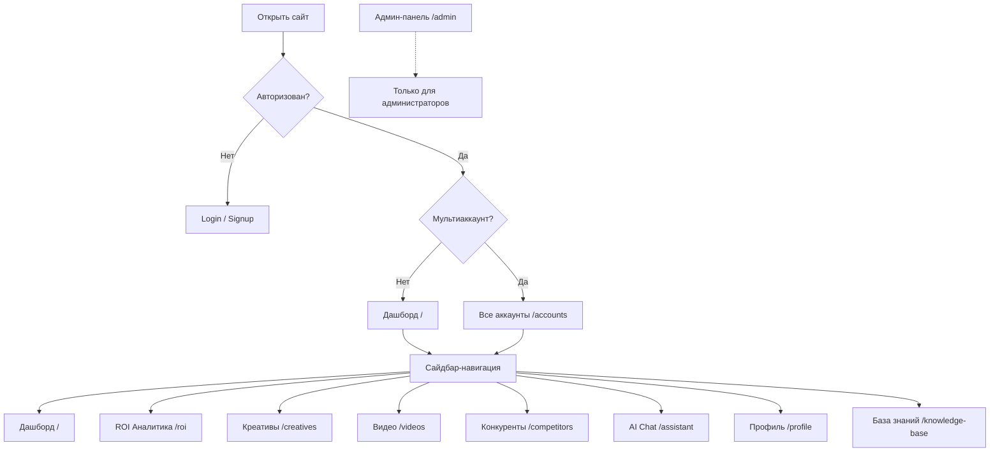
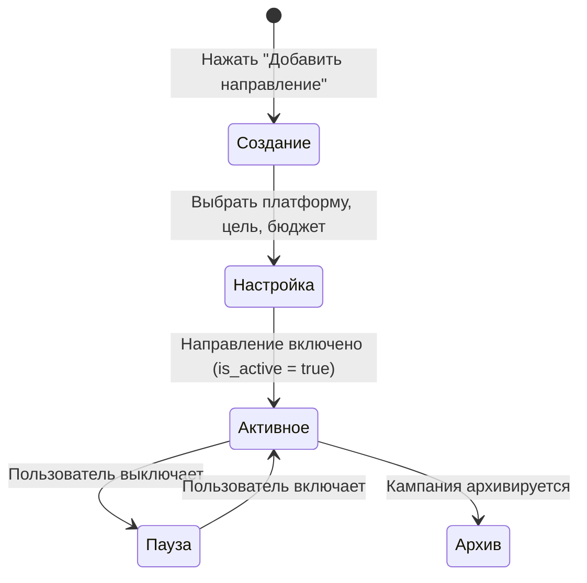
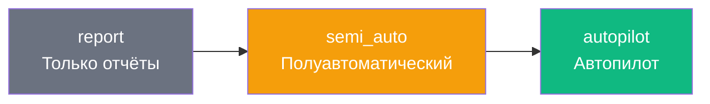
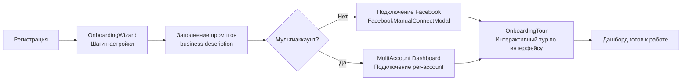
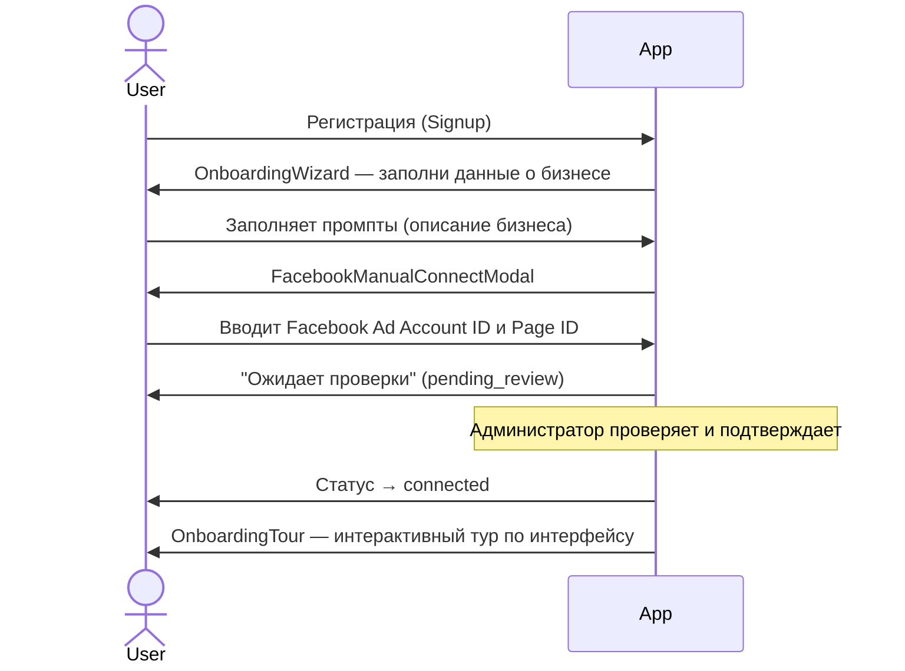
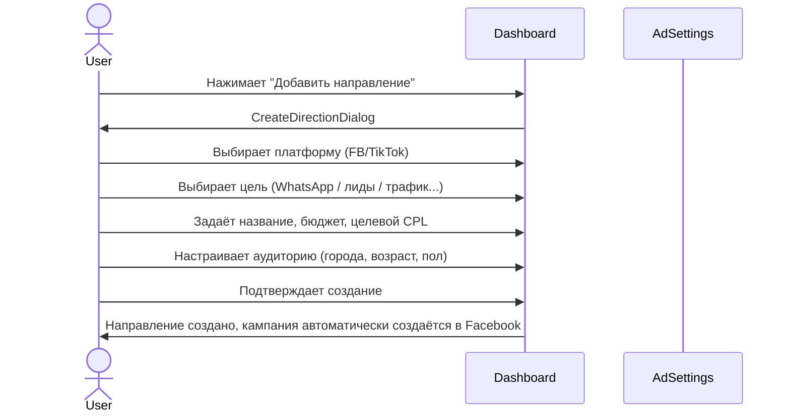
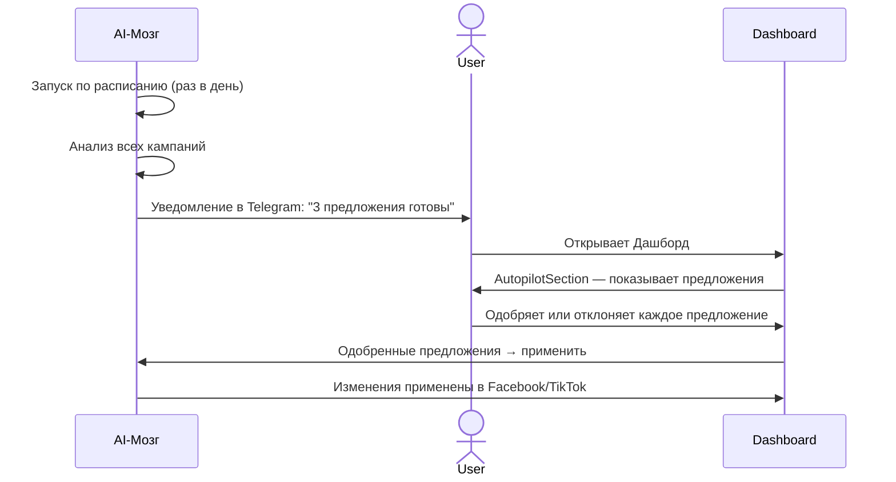
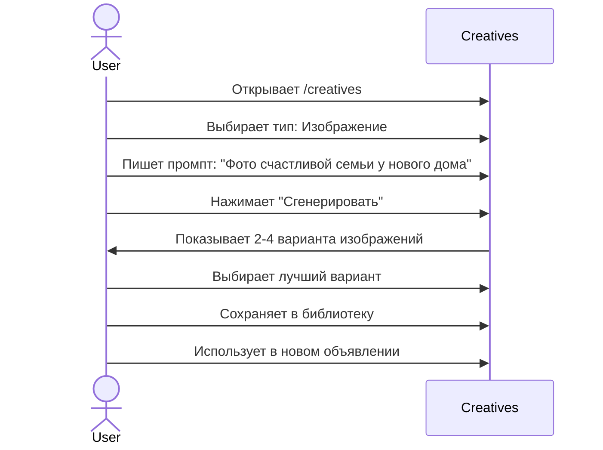
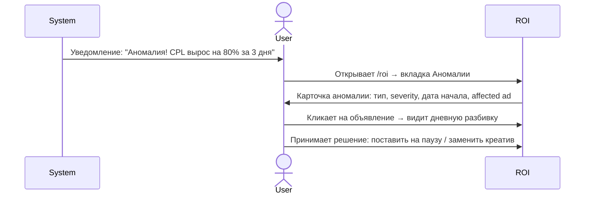

# Онбординг UX/UI дизайнера — performante.ai

> **Для кого этот документ:** дизайнер, который только присоединился к команде и хочет быстро понять продукт: что он делает, как устроен интерфейс, какие есть пользовательские сценарии и как выглядит дизайн-система.

---

## Содержание

1. [О продукте](#1-о-продукте)
2. [Глоссарий](#2-глоссарий-рекламных-терминов)
3. [Архитектура интерфейса](#3-архитектура-интерфейса)
4. [Разбор каждого раздела](#4-разбор-каждого-раздела)
5. [Ключевые пользовательские сценарии](#5-ключевые-пользовательские-сценарии)
6. [Дизайн-система](#6-дизайн-система)
7. [Ключевые файлы для дизайнера](#7-ключевые-файлы-для-дизайнера)
8. [Сложные UX-зоны и известные проблемы](#8-сложные-ux-зоны-и-известные-проблемы)

---

## 1. О продукте

### Что такое performante.ai?

**performante.ai** — это SaaS-платформа для автоматизации рекламы в Facebook/Instagram и TikTok. Она помогает маркетинговым командам и агентствам управлять рекламными кампаниями, генерировать креативы с помощью AI и оптимизировать результаты в режиме автопилота.

### Проблема, которую решает продукт

Управление рекламой в Facebook Ads и TikTok — это сложно: нужно постоянно следить за десятками кампаний, вручную корректировать бюджеты, анализировать эффективность креативов и реагировать на аномалии (резкий рост стоимости лида, «выгорание» объявлений). Для агентств это умножается на количество клиентов.

performante.ai автоматизирует эти рутинные задачи через AI-«Мозг», который сам анализирует кампании и либо отправляет предложения по оптимизации, либо выполняет их автоматически.

### Для кого продукт

- **Таргетологи** — специалисты по настройке рекламы в Facebook/TikTok
- **Маркетинговые агентства** — управляют несколькими рекламными аккаунтами клиентов
- **Бизнесы** — средний бизнес с рекламным бюджетом, которому нужна автоматизация

### Ключевые возможности продукта

| Возможность | Описание |
|---|---|
| **Управление кампаниями** | Просмотр, пауза/запуск, корректировка бюджетов кампаний Facebook и TikTok |
| **Направления** | Профили таргетинга — единица настройки для каждой цели бизнеса (WhatsApp, лиды, трафик и т.д.) |
| **AI-Мозг** | Автоматическая оптимизация кампаний: от отчётов до полного автопилота |
| **Генерация креативов** | AI создаёт изображения, карусели, тексты для рекламных объявлений |
| **Аналитика и аномалии** | Обнаружение проблем (рост CPL, «выгорание»), прогнозы производительности |
| **CRM-интеграция** | Автосинхронизация лидов с AmoCRM и Bitrix24 |
| **Мультиаккаунт** | Один интерфейс для нескольких рекламных аккаунтов (для агентств) |
| **Консультации** | Встроенная система записи на консультации с менеджерами |

---

## 2. Глоссарий рекламных терминов

Эти термины встречаются по всему интерфейсу — важно понимать их значение.

### Основные метрики

| Термин | Расшифровка | Простыми словами |
|---|---|---|
| **CPL** | Cost Per Lead — стоимость лида | Сколько стоит получить одно обращение от клиента |
| **CPM** | Cost Per Mille — стоимость 1000 показов | Сколько стоит показать рекламу тысяче людей |
| **CTR** | Click-Through Rate — кликабельность | Какой процент людей кликнул на рекламу |
| **CPR** | Cost Per Result — стоимость результата | Аналог CPL, используется в системе аномалий |
| **ROAS** | Return on Ad Spend — возврат на рекламные расходы | Сколько денег приносит каждый вложенный рубль |
| **Лид** | Lead | Потенциальный клиент, оставивший заявку |
| **Охват** | Reach | Количество уникальных людей, увидевших рекламу |
| **Показы** | Impressions | Общее число показов объявления (один человек = несколько показов) |
| **Частота** | Frequency | Среднее число раз, которое один человек видел рекламу |

### Структура рекламы Facebook

Реклама в Facebook имеет трёхуровневую иерархию:

```
Кампания (Campaign)
  └── Группа объявлений / Адсет (Ad Set)
        └── Объявление (Ad)
```

- **Кампания** — задаёт цель (например, «получить лиды»)
- **Адсет (Ad Set)** — задаёт аудиторию, бюджет, плейсменты
- **Объявление (Ad)** — конкретный креатив (видео, картинка, текст)

### Специальные термины платформы

| Термин | Значение |
|---|---|
| **Направление** | Профиль таргетинга в performante.ai — объединяет кампанию, настройки аудитории и цель бизнеса |
| **Мозг (Brain)** | AI-движок оптимизации. Анализирует кампании и предлагает или применяет изменения |
| **Аномалия** | Нестандартное отклонение метрики: резкий рост CPL, падение охвата, высокая частота |
| **Выгорание (Burnout)** | Ситуация, когда аудитория «устала» от объявления — CTR падает, CPL растёт |
| **CAPI** | Conversion API — серверное отслеживание конверсий (более точное, чем пиксель) |
| **Пиксель** | Facebook Pixel — скрипт на сайте для отслеживания действий посетителей |
| **Плейсменты** | Места показа рекламы: Лента, Stories, Reels, Explore и др. |
| **Advantage+** | Режим от Facebook, где алгоритм сам выбирает лучшую аудиторию |
| **Автопилот** | Режим Мозга, при котором оптимизация происходит без участия пользователя |
| **Адсет** | Сокращение от «Ad Set» — группа объявлений |

### Цели рекламных кампаний (Objectives)

В интерфейсе часто встречаются эти типы «направлений»:

| Objective | Описание |
|---|---|
| **WhatsApp** | Реклама с кнопкой «Написать в WhatsApp» — лид = новый диалог |
| **Instagram DM** | Реклама с кнопкой «Написать в Instagram» |
| **Instagram Traffic** | Реклама, ведущая на Instagram-профиль |
| **Конверсии (CAPI)** | Реклама оптимизируется по конверсиям — заявкам на сайте или в CRM |
| **Site Leads** | Лиды через форму на сайте |
| **Lead Forms** | Нативные лид-формы Facebook (заполняются прямо в Facebook) |
| **App Installs** | Реклама для установки мобильного приложения |

---

## 3. Архитектура интерфейса

### Общая структура приложения



### Навигация

Приложение состоит из **трёх зон**:

| Зона | URL | Кто видит |
|---|---|---|
| **Основное приложение** | `/`, `/roi`, `/creatives`, `/videos`, `/profile`, ... | Все авторизованные пользователи |
| **WhatsApp CRM** | `/whatsapp-analysis` | Пользователи с WhatsApp-интеграцией (без сайдбара) |
| **Админ-панель** | `/admin/*` | Только администраторы (отдельный layout) |

### Навигация в сайдбаре

Левый сайдбар (collapsible — сворачивается до иконок):

```
┌─────────────────────┐
│  Navigation         │
│  ─────────────────  │
│  🏠 Дашборд         │  /
│  🏢 Все аккаунты    │  /accounts  (только мультиаккаунт)
│  📈 ROI Аналитика   │  /roi
│  🎯 Креативы        │  /creatives
│  📤 Видео           │  /videos
│  👥 Конкуренты      │  /competitors
│  💬 AI Chat         │  /assistant
│  👤 Профиль         │  /profile
│  📖 База знаний     │  /knowledge-base
│  ─────────────────  │
│  performante.ai v1.0│
└─────────────────────┘
```

### Все маршруты приложения

**Публичные (без авторизации):**

| URL | Страница |
|---|---|
| `/login` | Вход |
| `/signup` | Регистрация |
| `/privacy` | Политика конфиденциальности |
| `/terms` | Условия использования |
| `/pay/:plan` | Оплата подписки |

**Основное приложение (авторизованные):**

| URL | Страница |
|---|---|
| `/` | Дашборд (или редирект на `/accounts` для мультиаккаунта) |
| `/accounts` | Все аккаунты (мультиаккаунт) |
| `/roi` | ROI Аналитика |
| `/creatives` | Генерация креативов |
| `/videos` | Библиотека видео |
| `/competitors` | Конкуренты |
| `/assistant` | AI Чат |
| `/profile` | Профиль и настройки |
| `/knowledge-base` | База знаний |
| `/campaign/:id` | Детали отдельной кампании |
| `/conversation-reports` | Аналитика диалогов WhatsApp |
| `/whatsapp-analysis` | WhatsApp CRM (без сайдбара) |
| `/ad-settings` | Настройки направлений |

**Админ-панель (`/admin/*`, только для администраторов):**

| URL | Страница |
|---|---|
| `/admin` | Дашборд |
| `/admin/users` | Пользователи |
| `/admin/subscriptions` | Подписки |
| `/admin/ads` | Реклама |
| `/admin/leads` | Лиды |
| `/admin/chats` | Чаты |
| `/admin/errors` | Ошибки |
| `/admin/ad-insights` | Инсайты |
| `/admin/notifications` | Уведомления |
| `/admin/settings` | Настройки |

---

## 4. Разбор каждого раздела

### 4.1 Дашборд (`/`)

**Главная страница продукта.** Здесь пользователь видит всё самое важное о своей рекламе.

**Что находится на Дашборде:**

```
┌───────────────────────────────────────────────────────┐
│  Header (шапка)                                       │
│  Логотип | Уведомления | Аватар аккаунта             │
├───────────────────────────────────────────────────────┤
│  Фильтры дат + переключатель аккаунта                │
├─────────────────┬─────────────────────────────────────┤
│                 │  Summary Stats (KPI-карточки):      │
│  Боковой        │  • Потрачено    • Лиды              │
│  сайдбар        │  • CPL          • Охват             │
│                 ├─────────────────────────────────────┤
│                 │  Autopilot Section (статус Мозга)   │
│                 ├─────────────────────────────────────┤
│                 │  Ad Status Section (статус объявл.) │
│                 ├─────────────────────────────────────┤
│                 │  Campaign List / Hierarchical Table │
│                 │  Список кампаний с метриками        │
│                 ├─────────────────────────────────────┤
│                 │  Directions Table (Направления)     │
│                 └─────────────────────────────────────┘
```

**Ключевые компоненты Дашборда:**

- **SummaryStats** — 4 KPI-карточки: потрачено, количество лидов, CPL, охват за выбранный период
- **AutopilotSection** — блок статуса AI-Мозга: какой режим включён, когда последний раз запускался, есть ли ожидающие предложения
- **AdStatusSection** — визуализация статуса объявлений (активные / на паузе / с аномалиями)
- **HierarchicalCampaignTable** — таблица с разворачивающейся иерархией: Кампания → Адсет → Объявление
- **DirectionsTable** — список «Направлений» — профилей таргетинга пользователя

**Действия пользователя на Дашборде:**
- Выбрать период дат для аналитики
- Переключиться между аккаунтами (если мультиаккаунт)
- Просмотреть метрики кампаний
- Поставить кампанию на паузу / возобновить
- Открыть детали кампании (переход на `/campaign/:id`)
- Одобрить предложение Мозга (если режим «Полуавтоматический»)
- Создать / редактировать Направление

---

### 4.2 Направления — AD Settings (`/ad-settings`)

**Что такое «Направление»?**

Направление — это центральная единица настройки в платформе. Это профиль рекламной кампании, который объединяет:
- **Цель** (objective): WhatsApp, лиды, трафик в Instagram и т.д.
- **Платформу**: Facebook, TikTok или обе
- **Настройки аудитории**: города, возраст, пол
- **Бюджет и целевой CPL**
- **Интеграции**: CRM, CAPI, WhatsApp-номер

Один пользователь может иметь несколько Направлений — например, «Продажи WhatsApp», «Лидформа», «TikTok Трафик».

**Жизненный цикл Направления:**



**Что можно настроить в Направлении:**

```
Направление "Продажи WhatsApp"
├── Платформа: Facebook
├── Цель: WhatsApp (реклама с кнопкой "Написать")
├── Дневной бюджет: 5,000 ₸
├── Целевой CPL: 1,500 ₸
├── WhatsApp номер: +7 777 123 45 67
├── Аудитория:
│   ├── Города: Алматы, Астана
│   ├── Возраст: 25-45
│   └── Пол: Все
├── CAPI (серверное отслеживание): включено
│   └── Источник: WhatsApp CRM
└── CRM-интеграция: AmoCRM
    └── Ключевые статусы: Квалификация, Запись
```

---

### 4.3 ROI Аналитика (`/roi`)

Страница с детальной аналитикой производительности рекламы. Это аналитическое «командование» — здесь видно не просто метрики, а проблемы и прогнозы.

**Структура страницы:**

```
┌──────────────────────────────────────────────────────┐
│  Фильтры: период / направление / аккаунт            │
├─────────────────────┬────────────────────────────────┤
│  Plan vs Fact       │  Аномалии                      │
│  Бюджет и лиды:     │  Список аномальных объявлений  │
│  план / факт / %    │  с уровнем critical/high/...   │
├─────────────────────┼────────────────────────────────┤
│  Burnout Prediction │  Recovery Prediction           │
│  Какие объявления   │  Какие объявления можно        │
│  «выгорят» и когда  │  «оживить» и как               │
├─────────────────────┴────────────────────────────────┤
│  Еженедельные инсайты (таблица по неделям)           │
├──────────────────────────────────────────────────────┤
│  Годовой аудит (Pareto, waste analysis)              │
└──────────────────────────────────────────────────────┘
```

**Уровни критичности аномалий:**

```
🔴 Critical  — немедленное вмешательство (CPL вырос >80%)
🟠 High      — приоритетное внимание
🟡 Medium    — следить
⚪ Low       — информационно
```

**Типы аномалий:**
- `cpr_spike` — резкий рост стоимости результата
- Высокая частота — аудитория видит объявление слишком часто
- Падение охвата — алгоритм перестал показывать объявление

---

### 4.4 Генерация креативов (`/creatives`)

**Что такое «Креатив»?**

Креатив — это рекламный материал: видео, изображение, карусель или текст объявления.

**Типы генерации:**

```
┌──────────────────────────────────────────┐
│           Генерация креативов            │
├──────────┬──────────┬──────────┬─────────┤
│ Изображения│ Карусели │  Тексты  │ Видео  │
│ (AI Генер.)│(AI Генер.)│(Варианты)│(Загрузка│
│            │          │          │+ обработ│
└──────────┴──────────┴──────────┴─────────┘
```

**Флоу генерации изображения:**
1. Пользователь вводит промпт (описание желаемого изображения)
2. Выбирает размер и стиль
3. AI генерирует варианты
4. Пользователь выбирает и сохраняет в библиотеку

**Библиотека видео (`/videos`):**
- Загрузка видео (поддержка большие файлы через TUS-протокол)
- Автоматическая транскрипция (речь → текст)
- Генерация вариантов текстов объявлений на основе транскрипции
- Управление библиотекой: просмотр, удаление, статус обработки

---

### 4.5 AI-Мозг (Brain) — раздел на Дашборде

**Что такое Мозг?**

Мозг — это AI-движок оптимизации, который работает по расписанию (обычно раз в день). Он анализирует все кампании аккаунта и принимает (или предлагает) решения.

**Три режима работы Мозга** (переключаются в настройках Профиля):



| Режим | Что делает Мозг | Участие пользователя |
|---|---|---|
| **report** (Только отчёты) | Анализирует и отправляет отчёт в Telegram | Читает отчёт, действует сам |
| **semi_auto** (Полуавтоматический) | Формирует предложения в интерфейсе | Одобряет или отклоняет каждое предложение |
| **autopilot** (Автопилот) | Автоматически применяет изменения | Минимальное: только мониторинг |

**Что Мозг может оптимизировать:**
- Перераспределение бюджета между адсетами
- Постановка на паузу «выгоревших» объявлений
- Запуск новых объявлений (из готовых креативов)
- Корректировка ставок

**Настройки Мозга (в Профиле):**
- Время запуска (час + часовой пояс)
- Режим (report / semi_auto / autopilot)
- Лимиты действий

---

### 4.6 Конкуренты (`/competitors`)

Страница анализа конкурентных объявлений. Используется таргетологами как источник вдохновения для новых креативов и понимания трендов в нише.

**Что делает пользователь:**
- Добавляет страницы конкурентов (Facebook Page ID или ссылка)
- Система собирает активные рекламные объявления конкурентов
- Пользователь просматривает их креативы, тексты и форматы
- Сохраняет интересные примеры как референсы для генерации своих креативов

**UX-особенность:** Страница является «галереей вдохновения» — акцент на визуальное отображение чужих объявлений, а не таблицы с цифрами.

---

### 4.7 AI Chat (`/assistant`)

Встроенный AI-чат на основе Claude/GPT-4. Это «умный помощник», который знает контекст аккаунта пользователя.

**Что умеет:**
- Отвечать на вопросы о текущих кампаниях («Почему вырос CPL?»)
- Давать рекомендации по оптимизации
- Объяснять метрики и аномалии простым языком
- Помогать с написанием рекламных текстов

**UX-паттерн:** Интерфейс в стиле мессенджера (сообщения + поле ввода). Поддерживает Markdown в ответах (жирный текст, списки, таблицы).

---

### 4.8 Профиль (`/profile`)

Самая насыщенная страница настроек. Содержит несколько вкладок:

```
Профиль
├── Основные настройки
│   ├── Данные аккаунта (имя, username)
│   └── Подписка (тариф, дата окончания)
├── Facebook / Instagram
│   ├── Статус подключения
│   ├── ID рекламного аккаунта
│   ├── Facebook Page ID
│   └── Instagram ID
├── TikTok
│   ├── Статус подключения (OAuth)
│   └── Business Account ID
├── AI-Мозг
│   ├── Режим (report / semi_auto / autopilot)
│   ├── Время запуска
│   └── Часовой пояс
├── WhatsApp
│   ├── Номера телефонов
│   └── Тип подключения (Evolution / WABA)
├── CRM-интеграция
│   ├── AmoCRM (subdomain, токены)
│   └── Bitrix24 (webhook, настройки)
├── CAPI (Conversion API)
│   └── Настройки серверного отслеживания
├── API Ключи
│   ├── OpenAI
│   ├── Gemini
│   └── Anthropic
└── Telegram
    └── ID для уведомлений от Мозга
```

**Статусы подключения аккаунта:**

```
🟡 pending          — Ожидает настройки
🟠 pending_review   — Ожидает проверки (администратором)
🟢 connected        — Подключён и работает
🔴 error            — Ошибка подключения
```

---

### 4.9 Мультиаккаунт (`/accounts`)

Страница для агентств и команд, управляющих несколькими клиентами.

**Что показывает:**
- Список всех рекламных аккаунтов
- Статус подключения каждого аккаунта
- Кнопки быстрого переключения
- Общая статистика по всем аккаунтам

**Поведение:**
- При первом входе пользователя с мультиаккаунтом — редирект на `/accounts`
- Переключение аккаунта обновляет весь интерфейс (Дашборд, данные и т.д.)

---

### 4.10 База знаний (`/knowledge-base`)

Встроенная документация и справочник для пользователей платформы. Структурирована в главы → разделы → статьи.

**Навигация:** Левое дерево-меню со списком глав, правая часть — контент статьи в Markdown. URL поддерживает прямые ссылки на раздел: `/knowledge-base/:chapterId/:sectionId`.

**UX-задача для дизайнера:** Сделать навигацию по базе знаний максимально быстрой — пользователь обычно ищет конкретный ответ, а не читает всё подряд.

---

### 4.11 Консультации (`/consultations`)

Модуль записи клиентов на консультации с менеджерами/специалистами. Это внутренняя CRM-замена для отдела продаж.

**Структура:**
```
┌───────────────────────────┬──────────────────────────┐
│  Список консультаций      │  Детали / Запись         │
│  scheduled → confirmed    │  Дата, время, клиент     │
│  → completed              │  Статус, заметки         │
│  cancelled / no_show      │  Отметить как продажу    │
└───────────────────────────┴──────────────────────────┘
```

**Статусы консультации:** `scheduled` → `confirmed` → `completed` / `cancelled` / `no_show`

---

### 4.12 WhatsApp CRM (`/whatsapp-analysis`)

Отдельный полноэкранный интерфейс для анализа WhatsApp-диалогов (без основного сайдбара). Предназначен для команд, которые обрабатывают входящие заявки через WhatsApp.

**Что показывает:**
- Аналитика по диалогам: объём, длительность, конверсия в продажу
- Распространённые возражения клиентов
- Статистика по каждому направлению (откуда пришёл лид)
- Сравнение периодов

**UX-особенность:** Это не мессенджер — это аналитический дашборд поверх данных из WhatsApp. Акцент на графиках и таблицах, а не на самих чатах.

---

### 4.13 Аналитика диалогов (`/conversation-reports`)

Страница со статистикой переписок по направлениям. Показывает метрики: сколько диалогов было, какой % перешёл в продажу, какие возражения чаще всего звучат.

---

### 4.14 Тарифы и подписка

Платная подписка — условие работы платформы. Управление тарифом происходит в двух местах:

- **Для пользователей** — в разделе Профиля (вкладка «Подписка»): показывает текущий тариф, дату окончания, стоимость продления
- **Для администраторов** — в `/admin/subscriptions`: управление тарифами всех пользователей

**Оплата:** Страница `/pay/:plan` → платёжная форма → редирект на `/pay/success` или `/pay/fail`

**Поведение при истёкшей подписке:** Пользователь видит ограниченный интерфейс — важно учитывать при проектировании (empty states, paywall-блоки).

---

### 4.15 Онбординг нового пользователя

При первом входе пользователь проходит **OnboardingWizard** — пошаговый мастер настройки:



---

### 4.16 Админ-панель (`/admin/*`)

Отдельный интерфейс только для администраторов платформы. Имеет собственный layout с отдельным сайдбаром.

**Разделы Админ-панели:**

| Раздел | URL | Что показывает |
|---|---|---|
| **Dashboard** | `/admin` | Общая статистика по платформе |
| **Пользователи** | `/admin/users` | Список всех пользователей, редактирование аккаунтов |
| **Подписки** | `/admin/subscriptions` | Управление тарифными планами |
| **Реклама** | `/admin/ads` | Обзор рекламных аккаунтов всех пользователей |
| **Лиды** | `/admin/leads` | Все лиды по платформе |
| **Чаты** | `/admin/chats` | Диалоги поддержки с пользователями |
| **Ошибки** | `/admin/errors` | Лог ошибок |
| **Инсайты** | `/admin/ad-insights` | Аномалии по всем аккаунтам |
| **Уведомления** | `/admin/notifications` | Центр уведомлений |
| **Настройки** | `/admin/settings` | Настройки платформы |

---

## 5. Ключевые пользовательские сценарии

### Сценарий 1: Новый пользователь подключает рекламный аккаунт



---

### Сценарий 2: Создание нового Направления



---

### Сценарий 3: Мозг в режиме «Полуавтомат» предлагает оптимизацию



---

### Сценарий 4: Генерация рекламного креатива



---

### Сценарий 5: Обнаружение аномалии и реакция



---

## 6. Дизайн-система

### Технологический стек UI

| Инструмент | Назначение |
|---|---|
| **Tailwind CSS 3.4** | Все стили — только utility классы, никакого кастомного CSS |
| **shadcn/ui** | Компонентная библиотека (Radix UI + Tailwind) |
| **Radix UI** | Доступные примитивы: Dialog, Select, Tooltip, Tabs, Accordion |
| **Lucide React** | Иконки (основной набор) |
| **Recharts** | Графики и диаграммы |
| **next-themes** | Темная/светлая тема (по умолчанию — тёмная) |

### Цветовая палитра (Tailwind)

**Статусы подключения:**
```
text-yellow-500  → pending (ожидает настройки)
text-orange-500  → pending_review (ожидает проверки)
text-green-500   → connected (подключён)
text-red-500     → error (ошибка)
```

**Уровни критичности аномалий:**
```
bg-red-500    → critical
bg-orange-500 → high
bg-yellow-500 → medium
bg-gray-400   → low
```

**Стандартные кнопки:**
```
bg-blue-600    → Primary (основное действие)
bg-gray-100    → Secondary / Ghost (вторичное)
bg-red-600     → Destructive (удаление, опасное действие)
```

### Типовые UI-паттерны

**Карточка (Card):**
```tsx
<Card>
  <CardHeader>
    <CardTitle>Заголовок</CardTitle>
  </CardHeader>
  <CardContent>
    Содержимое
  </CardContent>
</Card>
```

**Модальное окно (Dialog):**
Используется для всех форм создания/редактирования (создать направление, редактировать адсет, настроить CAPI).
- Открывается поверх основного контента
- Закрывается кнопкой ✕ или кликом вне окна
- Содержит форму + кнопки «Сохранить» / «Отмена»

**Tabs (вкладки):**
Используются на странице Профиля и в крупных разделах с несколькими блоками.

**Тултипы помощи (HelpTooltip):**
Кастомный компонент — знак вопроса `?` рядом с полем, при наведении объясняет, что это такое. Важно использовать для сложных настроек (CAPI, таргетинг).

**Toast-уведомления:**
Всплывающие уведомления в верхней части экрана (библиотека Sonner):
- ✅ Успех (зелёный)
- ❌ Ошибка (красный)
- ℹ️ Информация

### Иконки

Основная библиотека — **Lucide React**. Примеры иконок, используемых в навигации:

| Иконка | Назначение |
|---|---|
| `LayoutDashboard` | Дашборд |
| `TrendingUp` | ROI Аналитика |
| `Target` | Креативы |
| `Upload` | Видео |
| `Users2` | Конкуренты |
| `MessageSquare` | AI Chat |
| `User` | Профиль |
| `BookOpen` | База знаний |
| `Building2` | Все аккаунты |

### Адаптивность

- **Desktop (lg+):** Полный интерфейс с раскрытым сайдбаром
- **Tablet (md):** Сайдбар сворачивается до иконок
- **Mobile:** Сайдбар скрыт (`hidden lg:flex`). Мобильная версия минимальна — основная аудитория работает с десктопа

### Темная тема

По умолчанию приложение открывается в **тёмной теме**. Переключатель темы управляется через `next-themes`. Интерфейс Telegram WebApp автоматически подхватывает тему Telegram пользователя.

> **Важно:** При проектировании новых экранов всегда начинай с тёмной темы — она основная.

### Типографика

Tailwind использует системный шрифт-стек (system-ui). Ключевые размеры в интерфейсе:

| Класс Tailwind | Применение |
|---|---|
| `text-2xl font-bold` | Заголовки страниц |
| `text-xl font-semibold` | Заголовки карточек |
| `text-lg font-medium` | Подзаголовки |
| `text-sm` | Основной текст в таблицах, формах |
| `text-xs text-muted-foreground` | Вспомогательный текст, подсказки |

### Spacing

Tailwind spacing scale. Часто используемые отступы:
- `p-4` / `p-6` — внутренние отступы карточек
- `gap-4` / `gap-6` — расстояния между элементами сетки
- `space-y-4` — вертикальные отступы между блоками
- `mb-4` — отступ между компонентами

### Состояния интерфейса

Дизайнеру важно проектировать все состояния экрана, не только «happy path»:

**Загрузка (Loading):**
- Для таблиц — скелетоны (Skeleton компонент из shadcn)
- Для кнопок — спиннер внутри кнопки + `disabled`
- Для страниц — центрированный текст «Загрузка...»

**Пустое состояние (Empty State):**
- Когда нет кампаний — призыв к действию «Создать первое направление»
- Когда нет данных за период — иллюстрация + пояснение
- Пример: нет аномалий → «Всё в порядке, аномалий не обнаружено»

**Ошибка (Error State):**
- Toast-уведомление (красный, верхний центр экрана)
- Для форм — инлайн-ошибка под полем (Zod + React Hook Form)
- Для страниц с ошибкой загрузки — блок с текстом ошибки + кнопка «Повторить»

**Успех (Success State):**
- Toast-уведомление (зелёный)
- Для форм — закрытие модалки + обновление данных на странице

### Telegram WebApp

Приложение работает в двух средах:
- **Браузер** — стандартный веб-интерфейс
- **Telegram Mini App** — встроенное приложение внутри Telegram

В Telegram-версии:
- Тема (тёмная/светлая) синхронизируется с темой Telegram пользователя
- Кнопки и отступы должны быть touch-friendly (min-height 44px)
- Некоторые нативные браузерные элементы ведут себя иначе

---

## 7. Ключевые файлы для дизайнера

### Точки входа и структура

| Файл | Что делает |
|---|---|
| [services/frontend/src/App.tsx](../services/frontend/src/App.tsx) | Маршрутизация, onboarding flow, layout-логика |
| [services/frontend/src/components/AppSidebar.tsx](../services/frontend/src/components/AppSidebar.tsx) | Боковая навигация |
| [services/frontend/src/components/Header.tsx](../services/frontend/src/components/Header.tsx) | Шапка приложения |
| [services/frontend/src/context/AppContext.tsx](../services/frontend/src/context/AppContext.tsx) | Глобальное состояние (кампании, аккаунты, autopilot) |

### Основные страницы

| Файл | Страница |
|---|---|
| [services/frontend/src/pages/Dashboard.tsx](../services/frontend/src/pages/Dashboard.tsx) | Главная страница |
| [services/frontend/src/pages/Profile.tsx](../services/frontend/src/pages/Profile.tsx) | Профиль и настройки |
| [services/frontend/src/pages/ROIAnalytics.tsx](../services/frontend/src/pages/ROIAnalytics.tsx) | ROI Аналитика |
| [services/frontend/src/pages/CreativeGeneration.tsx](../services/frontend/src/pages/CreativeGeneration.tsx) | Генерация креативов |
| [services/frontend/src/pages/Creatives.tsx](../services/frontend/src/pages/Creatives.tsx) | Библиотека видео |
| [services/frontend/src/pages/MultiAccountDashboard.tsx](../services/frontend/src/pages/MultiAccountDashboard.tsx) | Мультиаккаунт |
| [services/frontend/src/pages/admin/](../services/frontend/src/pages/admin/) | Все страницы Админ-панели |

### Ключевые компоненты

| Файл | Описание |
|---|---|
| [services/frontend/src/components/AutopilotSection.tsx](../services/frontend/src/components/AutopilotSection.tsx) | Блок Мозга на Дашборде |
| [services/frontend/src/components/AdStatusSection.tsx](../services/frontend/src/components/AdStatusSection.tsx) | Статус объявлений |
| [services/frontend/src/components/HierarchicalCampaignTable.tsx](../services/frontend/src/components/HierarchicalCampaignTable.tsx) | Таблица кампаний |
| [services/frontend/src/components/VideoUpload.tsx](../services/frontend/src/components/VideoUpload.tsx) | Загрузка и обработка видео |
| [services/frontend/src/components/profile/](../services/frontend/src/components/profile/) | Все компоненты раздела Профиль |
| [services/frontend/src/components/onboarding/](../services/frontend/src/components/onboarding/) | Онбординг-визард и тур |

### Типы (доменная модель)

| Файл | Что описывает |
|---|---|
| [services/frontend/src/types/direction.ts](../services/frontend/src/types/direction.ts) | Направления, цели кампаний, CAPI |
| [services/frontend/src/types/adAccount.ts](../services/frontend/src/types/adAccount.ts) | Рекламные аккаунты, режимы Мозга |
| [services/frontend/src/types/adInsights.ts](../services/frontend/src/types/adInsights.ts) | Аномалии, прогнозы выгорания |

### Настройка фич (feature flags)

| Файл | Что делает |
|---|---|
| [services/frontend/src/config/appReview.ts](../services/frontend/src/config/appReview.ts) | Флаги включения/выключения разделов (`FEATURES.SHOW_ROI_ANALYTICS` и т.д.) |

---

## 8. Сложные UX-зоны и известные проблемы

Это области, где сейчас наибольшая сложность — именно здесь дизайнер может принести максимум пользы.

### Профиль — перегруженная страница настроек

Страница Профиля содержит 8+ разделов настроек (Facebook, TikTok, WhatsApp, CRM, CAPI, Мозг, API-ключи, Telegram). Для нового пользователя это непонятный набор полей с техническими ID. **Задача дизайнера:** найти логическую группировку, прогрессивное раскрытие сложности, понятный onboarding-путь.

### Создание Направления — высокая когнитивная нагрузка

Диалог создания Направления требует от пользователя много решений сразу: платформа, цель, бюджет, аудитория, CRM-настройки, CAPI. Новый пользователь теряется. **Задача:** разбить на шаги (wizard) или сделать умные defaults.

### Мозг — непрозрачность решений

Когда Мозг применяет изменения (autopilot), пользователь не всегда понимает, что именно произошло и почему. «История действий» существует, но слабо акцентирована. **Задача:** сделать действия Мозга видимыми и объяснимыми.

### HierarchicalCampaignTable — плотность данных

Таблица кампаний → адсетов → объявлений содержит много колонок с метриками. На небольших экранах данные «уезжают» за край. **Задача:** приоритизация колонок, адаптивность, возможность кастомизации видимых полей.

### Онбординг — ожидание подтверждения администратором

После регистрации и заполнения данных пользователь попадает в статус `pending_review` и ждёт ручного подтверждения от администратора. Это узкое место — непонятно, что происходит и сколько ждать. **Задача:** сделать экран ожидания информативным и успокаивающим.

### Feature Flags — часть интерфейса может быть скрыта

Некоторые разделы (ROI, Kreatives, Competitors) управляются флагами в [services/frontend/src/config/appReview.ts](../services/frontend/src/config/appReview.ts). При локальной разработке нужно убедиться, что нужные флаги включены. Иначе пунктов в сайдбаре и маршрутов не будет.

---

## Быстрый старт для дизайнера

### День 1 — Понять продукт
1. Прочитать этот документ полностью
2. Попросить у команды доступ к рабочему инстансу — нет ничего ценнее живого продукта
3. Пройти путь нового пользователя: зарегистрироваться → подключить аккаунт → создать направление

### День 2 — Понять интерфейс
4. Запустить приложение локально: `cd services/frontend && npm run dev` (порт 3001)
5. Открыть [services/frontend/src/config/appReview.ts](../services/frontend/src/config/appReview.ts) и убедиться, что все `FEATURES.*` = `true`
6. Изучить [services/frontend/src/pages/Dashboard.tsx](../services/frontend/src/pages/Dashboard.tsx) — главная страница
7. Изучить [services/frontend/src/pages/Profile.tsx](../services/frontend/src/pages/Profile.tsx) — самая сложная страница

### День 3 — Понять домен
8. Прочитать [services/frontend/src/types/direction.ts](../services/frontend/src/types/direction.ts) — главная бизнес-сущность
9. Прочитать [services/frontend/src/types/adAccount.ts](../services/frontend/src/types/adAccount.ts) — структура аккаунта
10. Задать команде вопросы по разделу [«Сложные UX-зоны»](#8-сложные-ux-зоны-и-известные-проблемы) — там приоритеты работы
